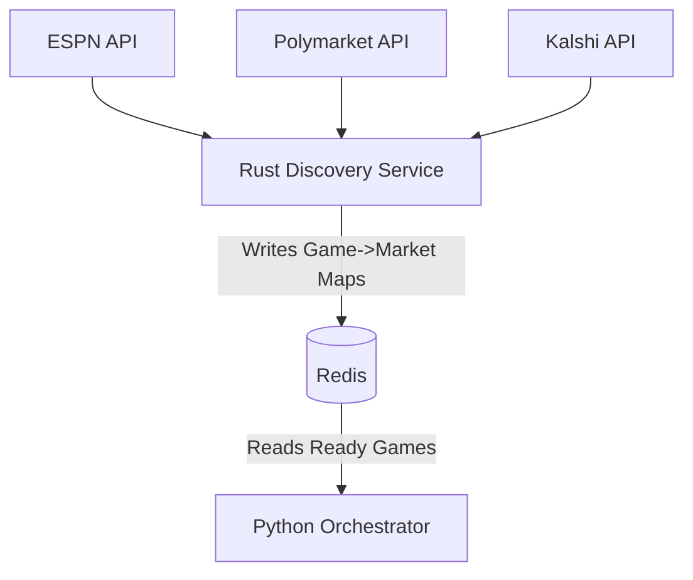

# Design: Rust Market Discovery Service

## Problem
Currently, the Python `Orchestrator` handles both cluster management and heavy market discovery logic (polling APIs, parsing thousands of strings). This causes CPU blocking and latency issues.

## Proposed Solution
Offload the "Data Gathering" logical into a dedicated **Rust Microservice**.

**Why Rust?**
*   **Concurrency**: `Tokio` can handle hundreds of concurrent API requests (searching Polymarket tags) much more efficiently than Python's asyncio loop.
*   **Safety**: Strong typing prevents "NoneType" errors when parsing malformed market data.
*   **Performance**: Regex and string matching (Team A vs Team B) is significantly faster.

### Architecture



### Implementation Details

#### 1. New Crate: `market_discovery`
Located in `rust_core/market_discovery` or as a separate workspace member.

**Dependencies**:
*   `tokio`: Async runtime.
*   `reqwest`: HTTP Client for API polling.
*   `serde_json`: JSON parsing.
*   `redis`: To push mappings to the Orchestrator.
*   `regex`: For high-performance title parsing.

#### 2. Discovery Logic
The service will run three concurrent loops:

1.  **Game Poller (ESPN)**:
    *   Fetches "Live" and "Scheduled" (next 2h) games.
    *   Struct: `Game { id, home, away, sport, time }`.

2.  **Market Searcher (Workers)**:
    *   For each active `Game`, spawns a task to search Polymarket/Kalshi.
    *   Uses **Fuzzy Matching** (SimHash or Levenshtein) to robustly match "Notre Dame" vs "Notre Dame Fighting Irish".
    *   Resolves Token IDs (using the logic we just fixed in Python, but ported to Rust).

3.  **Publisher**:
    *   Updates Redis key `game:{id}:mapping` with the found Market IDs.
    *   Sets TTL (e.g., 5 minutes) to ensure stale data expires if the service dies.

#### 3. Data Schema (Redis)
Key: `discovery:game:{game_id}`
Value (JSON):
```json
{
  "game_id": "40123456",
  "sport": "ncaab",
  "markets": {
    "polymarket": {
      "moneyline": "0x123...",
      "spread": "0x456..."
    },
    "kalshi": {
      "moneyline": "TICKER-24"
    }
  },
  "last_updated": 1700000000
}
```

## Migration Steps
1.  **Initialize Rust Project**: Set up `rust_discovery` binary.
2.  **Port Clients**: Implement minimal `PolymarketClient` and `ESPNClient` in Rust.
3.  **Implement Logic**: Port the "Team A vs Team B" parsing and token resolution.
4.  **Connect Redis**: Ensure it writes to the channel the Orchestrator expects.
5.  **Decommission Python Logic**: Remove the discovery loop from `orchestrator.py`.
